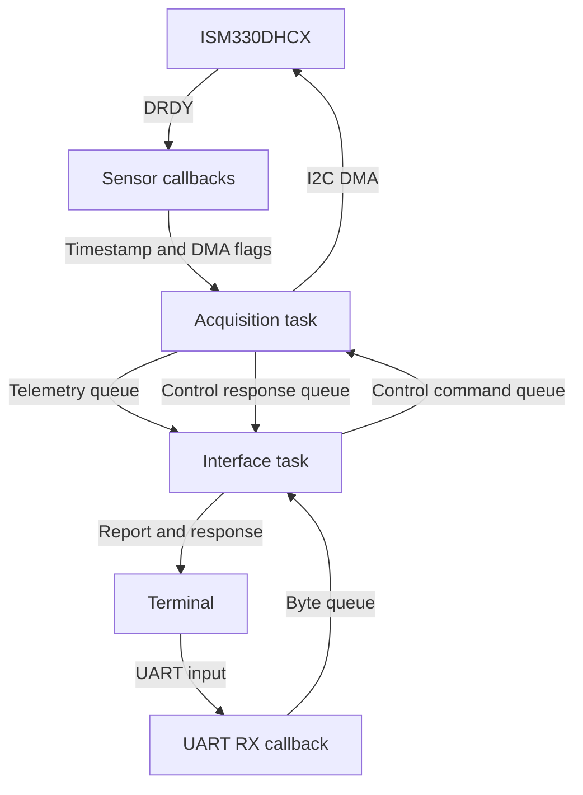

# STM32 Condition Monitor

An Embedded C / FreeRTOS learning project using an STM32L476RG and an
ISM330DHCX IMU. The firmware acquires timestamped motion samples with I2C DMA,
calculates accelerometer features over 128-sample windows, and exposes a
condition-monitoring prototype through a UART command interface.

This repository is a checkpoint of the STM32 work. Further feature development
is paused while the learning project moves to embedded Linux.

## Implemented

- Custom ISM330DHCX register driver: identification, reset, configuration,
  raw decoding, physical conversion, and DMA read entry point.
- Accelerometer DRDY interrupt on PB10; TIM2 timestamps at 1 MHz.
- Asynchronous acquisition with DMA completion/error callbacks, bounded sample
  buffering, and dropped-sample diagnostics.
- Per-window mean removal, RMS and absolute peak on each acceleration axis;
  maximum centered vector magnitude with sample index and DRDY timestamp.
- Normal, warning, alarm and latched sensor-fault states, severity accumulation,
  decay and hysteresis.
- Separate acquisition and interface tasks, with queues for UART bytes,
  telemetry, control commands and responses.
- Interrupt-driven UART receive, bounded command assembly, backspace support,
  on-demand status, start/stop and runtime impact-reference changes.
- UART receive recovery after errors or queue overflow; interrupted commands
  are discarded through the next line terminator.
- Host checks for condition policy, acquisition callback ordering, window
  calculations and CLI assembly.

## Hardware and configuration

| Item | Configuration |
|---|---|
| MCU board | NUCLEO-L476RG, 80 MHz |
| Sensor shield | X-NUCLEO-IKS02A1 |
| IMU | ISM330DHCX, I2C1, 7-bit address `0x6B` |
| I2C pins | PB8 SCL, PB9 SDA |
| Accelerometer | 104 Hz nominal, +/-4 g, high performance |
| Gyroscope | 104 Hz nominal, +/-500 dps, high performance |
| Sensor interrupt | ISM330DHCX INT1 to PB10, rising EXTI |
| Timestamp | Free-running 32-bit TIM2, 1 MHz |
| UART | USART2, PA2 TX / PA3 RX, ST-LINK virtual COM port |
| Terminal settings | 115200 baud, 8 data bits, no parity, 1 stop bit, no flow control |
| Other timers | TIM7 HAL timebase; TIM6 LED event |

Mount the shield and connect its ISM330DHCX INT1 route to PB10. Connect the
NUCLEO ST-LINK USB port to the computer for programming and the virtual COM
port. The `.ioc` file records the peripheral configuration.

The timestamp means **MCU-observed DRDY time**, captured in EXTI. It is neither
DMA completion time nor the sensor's internal timestamp. TIM2 wraps after
approximately 71.6 minutes; intervals use unsigned subtraction.

Development measurements showed approximately 8883-8889 us between DRDY
events (about 112-113 Hz) despite the nominal 104 Hz setting. Timing analysis
uses measured timestamps rather than assuming exact nominal ODR.

## Build and run

1. Clone the repository and open STM32CubeIDE.
2. Use **File > Import > General > Existing Projects into Workspace** and select
   the repository directory. The IDE project is named `stm32-motion-monitor`.
3. Build the **Debug** configuration and program the NUCLEO through ST-LINK.
4. Open its virtual COM port with the terminal settings above.
5. Send `help`, then `get status` after a complete window has accumulated.

The generated configuration records STM32CubeMX 6.18.1 and STM32CubeL4 1.18.2.
HAL, CMSIS, BSP and FreeRTOS sources are included. Code regeneration is optional
for building the checked-in project. User additions reside in CubeMX
`USER CODE` regions.

In PuTTY, enable **Terminal > Local echo > Force on** to see typed input.
Commands are lowercase, terminate with CR or LF, and allow 32 characters
excluding the terminator. Backspace (`0x08`) and DEL (`0x7F`) edit the line.
An overlong line is discarded. After UART receive recovery, press Enter to
restore the line boundary, then resend the command.

## Commands

| Command | Behavior |
|---|---|
| `help` | List implemented and planned commands |
| `get status` | Print the latest cached report and acquisition state |
| `start` | Resume a stopped sensor using its saved configuration |
| `stop` | Drain the in-flight read, discard partial data and power down both sensors |
| `get impact-reference` | Read the current severity reference in m/s^2 |
| `set impact-reference <mps2>` | Apply a finite positive reference in the acquisition task |

`Request submitted` means the command was queued. The later response reports
whether it was applied. Repeated `start` while running and `stop` while stopped
succeed without restarting a transfer. A stop that cannot drain DMA within
50 ms enters the acquisition fault state and returns failure.

Status is printed only on request. Stop retains the last completed measurement
and severity score, and the report labels that measurement as retained. Resume
starts a fresh window. An impact-reference change preserves the existing score
and affects subsequent windows.

The parser recognizes `get config`, `get rate`, `set rate`, `get errors` and
`get version`, but their application handlers are **not implemented**.

A successful command exchange looks like this (abbreviated):

```text
> stop
Request submitted
Acquisition stopped
> start
Request submitted
Acquisition started
```

## Ownership and data flow



| Owner | Responsibility |
|---|---|
| Acquisition task, normal priority, 2048-byte stack | Sensor transactions, sample conversion, buffering, windows, condition policy and control application |
| Interface task, low priority, 3000-byte stack | UART recovery, command assembly/parsing, requests, response printing, telemetry cache and LED/button handling |
| Sensor callbacks | Publish DRDY timestamps and DMA completion/error events |
| UART callbacks | Queue completed bytes, rearm reception or request task-side recovery |

Queues copy values, so commands and telemetry do not depend on a caller's
temporary object remaining alive. Acquisition owns sensor configuration; the
interface submits requests. UART output uses blocking HAL transmission in the
interface task. Interrupt callbacks do not print or wait on queues.

The queues hold 64 RX bytes, 4 telemetry reports, 2 commands and 2 responses.
Acquisition consumes the newest pending DRDY; superseded register samples
cannot be recovered and are counted as dropped. The counter and timestamp are
captured together in a short critical section. Interrupts are restored before
the DMA start call.

## Condition policy

Each window is centered by subtracting its per-axis mean. RMS and absolute
peaks describe the resulting acceleration in m/s^2. The largest Euclidean
magnitude across the centered samples feeds the policy:

```text
contribution = max(0, maximum_magnitude / impact_reference - 1)
score = min(maximum_score, decay_factor * previous_score + contribution)
```

Defaults: reference 1 m/s^2, decay 0.8 per completed window, warning entry 3 /
exit 1, alarm entry 10 / exit 6, score cap 100, and sensor fault after 3
consecutive acquisition errors. Warning and alarm use hysteresis. Sensor fault
is latched until reset. Score changes require a complete new window; sensor
health can still be checked without one.

## Host checks

With GCC and GNU Make installed, run from the repository root in Linux or WSL:

```sh
make -C tests/host test
```

Tests compile production modules with `-std=c11 -Wall -Wextra -Werror`.
Acquisition and analysis checks use a small host HAL declaration stub;
acquisition checks simulate interrupt ordering and driver outcomes. They do not
emulate hardware or a FreeRTOS scheduler. `tests/` is outside the CubeIDE
firmware source roots. Binaries go to ignored `build/host/`.

See [verification notes](docs/verification.md) for cleanup checks and the board
verification boundary.

## Limitations and future work

- Startup transients can produce a large severity score; settling/calibration
  is not implemented.
- Mean removal is not a gravity/attitude estimator. Board rotation can appear
  as dynamic acceleration.
- Severity is a demonstration heuristic; thresholds are not calibrated for a
  particular machine or failure mechanism. Gyro data is acquired but does not
  feed the condition policy.
- Acquisition and sensor faults require reset; autonomous recovery is not
  implemented. Command responses can be dropped if their bounded queue fills.
- Telemetry is a human-readable CLI report. A stable machine-readable protocol
  and runtime sampling-rate changes are future work.
- FFT, FIFO, attitude estimation, CAN, bootloader and remote firmware updates
  remain outside the implemented checkpoint.

Driver details: [ISM330DHCX driver](docs/ism330dhcx-driver.md).
Design rationale: [driver selection decision](docs/decisions/0001-ism330dhcx-driver-selection.md).
